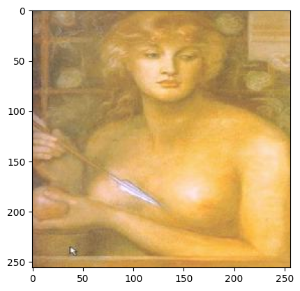

# Unsupervised Image Restoration with Clustering and Super-Resolution

## Overview
This project explores an **unsupervised approach** to **image restoration**, focusing on reconstructing damaged artworks. The pipeline leverages **deep learning, clustering techniques, and super-resolution** to recover high-quality images without supervised labels.

## Pipeline
The restoration process consists of several key steps:

### 1. **Autoencoder for Latent Representations**
- A **ResNet34-based autoencoder** is used to encode images into a **latent space representation**.
- The decoder reconstructs the image from this compressed representation.
- This step verifies whether the model correctly learns meaningful embeddings.

### 2. **Generating and Applying Damage Masks**
- **MaskGenerator.py** creates masks that simulate missing parts of images.
- **PictureDamager_torch.py** applies **random transformations** such as **erosion, dilation, flipping, scaling**, and occlusions to degrade the images.
#### Example Masks

  
  
  

### 3. **Clustering in Latent Space**
- Images are **encoded into latent vectors** and then projected to a **lower-dimensional space** using **UMAP**.
- The **KMeans algorithm** clusters similar images together, grouping them based on learned latent features.
- These clusters serve as priors for better restoration quality.

#### Example Clusters (3 of 20)
##### Cluster 1

  
  
  

##### Cluster 2

  
  
  

##### Cluster 3

  
  
  

### 4. **Inpainting with Cluster-Aware Embeddings**
- The damaged images are **encoded and assigned to their closest cluster**.
- An **embedding vector** corresponding to the cluster is added to the encoded representation.
- The decoder reconstructs the images using both the latent representation and the cluster embedding.
- This approach significantly improves the quality of the restored images.

#### Reconstructed Photos

### 5. **Super-Resolution** (Final Enhancement)
- A final **unsupervised super-resolution** step is applied to refine details and enhance the reconstructed images.
- This ensures the highest possible fidelity to the original artwork.

#### Superresolution

## Results
- The proposed method **successfully restores missing parts** of images without requiring explicit supervision.
- The **clustering step significantly improves** reconstruction quality by leveraging context from similar images.
- The **super-resolution step enhances final details**, producing **high-quality, visually coherent restorations**.

## Acknowledgments
This project utilizes **PyTorch, PyTorch Lightning, torchvision, UMAP, KMeans, and CometML** for experiment tracking.

---
**Authors:** Komorowska Julia, Rywka Włodzimierz, Włostek Piotr  
**Date:** January 2025

